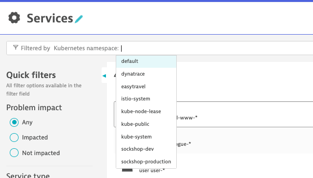
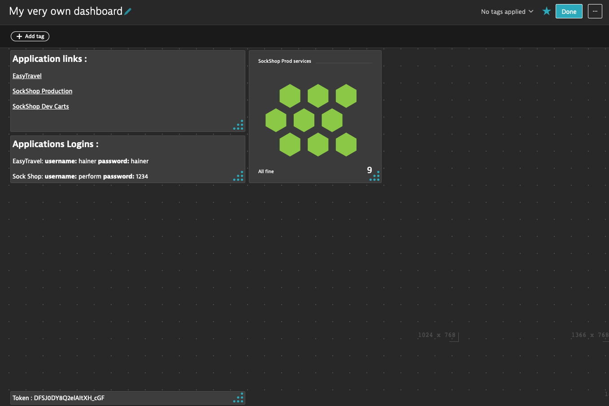

## Exercise #3 Set up automatic import of Kubernetes labels and annotations

### Explore metadata in pod definitions

List all the Sock Shop pods running:

```sh
$ kubectl get po -l product=sockshop --all-namespaces 
```

Let's look at the description of the `carts` pod in the `sockshop-dev` namespace. 

```sh
$ kubectl describe po -l app=carts -n sockshop-dev
```


### Grant viewer role to service accounts

Those <b>Labels</b> and <b>Annotations</b> are centrally defined and managed in Kubernetes but we also want them available in Dynatrace for grouping, filtering and contextualization purposes. In Dynatrace, grouping and filtering is typically done by the use of <b>tags</b>; context is provided by entity <b>properties</b>.

The OneAgent will use a pod <i>service account</i> to query for this metadata via the Kubernetes REST API.

The service accounts must be granted <b>viewer</b> role in order to have this access.

In the terminal, execute the following command to grant viewer role. This needs to be done for each <b>namespace</b>.

```sh
$ kubectl -n sockshop-production create rolebinding default-view --clusterrole=view --serviceaccount=sockshop-production:default
```

Repeat the procedure for the `sockshop-dev` namespace.

```sh
$ kubectl -n sockshop-dev create rolebinding default-view --clusterrole=view --serviceaccount=sockshop-dev:default
```

### Wait... or not

Normally you would have to wait between 5-10 minutes before the labels and annotations show up as tags and properties in Dynatrace for the <b>Processes</b> and <b>Services</b> entities. But you won't have to wait :grinning:. Those commands have already been executed during the environment bootstraping.

In the Dynatrace console: 

- Navigate to one of the process group, for example the front-end (<b>Technologies -> Node.js -> server.js -> Process group details</b>)
- Expand the properties. 
- The imported Kubernetes <i>labels</i> will show as <b>tags</b> and the <i>annotations</i> as <b>properties</b>.


### Search/filter with tags based on labels

- Go in the <b>Technologies</b> or the <b>Services and Transactions</b> view. 

- In the Filtered by text box, you will see the available tags that you can select.


You can also perform searches for label values in the Super Search box!


You will see that not only <b>Processes</b> are showing up but <b>Services</b> too. This is because the labels are automatically propagated from the <b>Process</b> entity to the <b>Service</b> implemented by the process!

- Select and drill-down the service to see the labels attached as tags.

You might have noticed that it is also possible, in the <i>Services and Transactions</i> view, to filter by other Kubernetes properties such as cluster, namespaces, namespace labels and workload label. 



### Your very own dashboard - take 1

One of the nice thing you can do with the tags is that you can create a custom view with a filtered list of <b>Services</b> and pin that to a dashboard. As you can imagine, in large environments, the list of services can get quite long and it becomes time consuming to sift through the list. And having to go through the clicking to set tags in the filter bar every time is quite repetitive.

There's a better way.

As you log in the Dynatrace console, you want, within a single click, to be able to access the list of services for the Sock Shop product and only the services running in the production environment. You don't want anything else in that list that would distract you.

- Go to <b>Menu -> Transactions and Services</b>
- In the filter text box <b>(1)</b>, select:
  -  `Tag` `[Kubernetes]product` `sockshop`
  -  `Tag` `[Kubernetes]stage` `prod`
- Click on the edit icon (pencil) next to the screen title (Services). <b>(2)</b> Change the title to: `SockShop Prod services` and click on the check mark to confirm. 
- Click on <b>Pin to dashboard</b> <b>(3)</b>


- By default, your very own dashboard should be selected, otherwise please do so
- Click on <b>Pin</b> then </b>Open dashboard</b>


Your dashboard should look like this. Don't forget to click the <b>Done</b> button.



&nbsp;

Now from this starting dashboard, you can click on the <b>SockShop Prod services</b> tile and directly drill-down to the filtered service view! 

&nbsp;

---

[Previous : #1 : Explore your Environment](../01_Explore_Your_Environment/README.md) :arrow_backward: :arrow_forward: [Next : #3 : Customize Service Naming](../03_Customize_Service_naming/README.md)

:arrow_up_small: [Back to overview](../README.md)