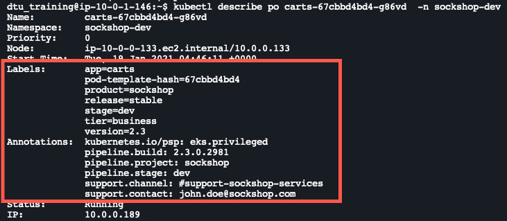
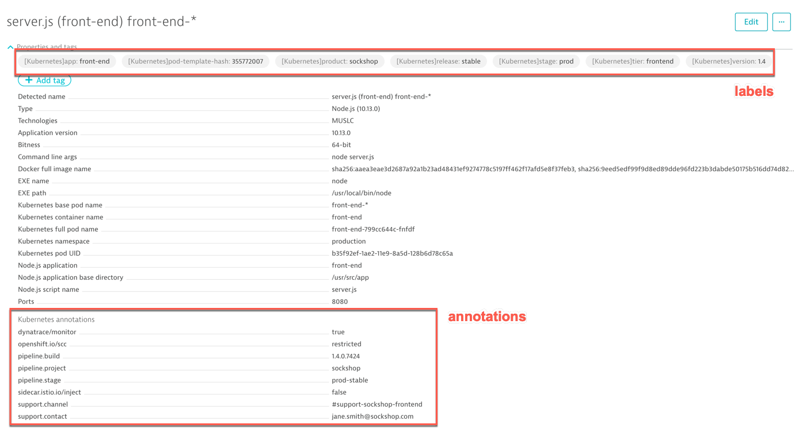
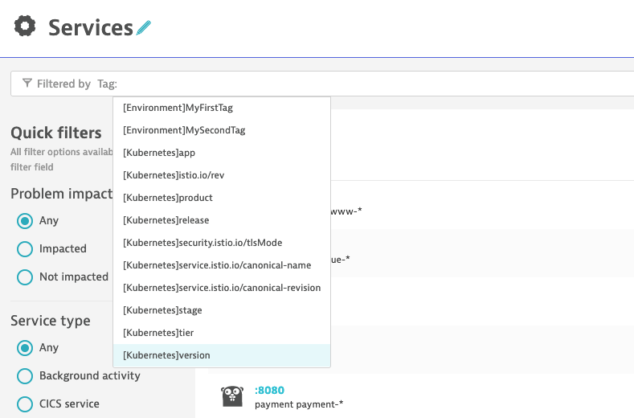
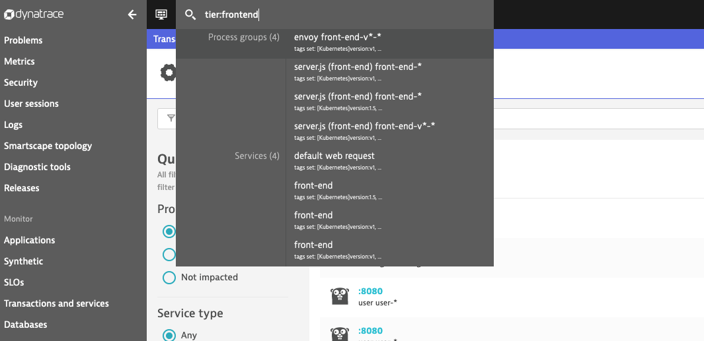

## Exercise #3 Set up automatic import of Kubernetes labels and annotations

### Explore metadata in pod definitions

List all the Sock Shop pods running:

```sh
$ kubectl get po -l product=sockshop --all-namespaces 
```

Pick up a pod a namespace (`sockshop-dev` for example), copy its name and get the pods details, including the <i>Labels</i> and the <i>Annotations</i>. 

```sh
$ kubectl describe po <pod_name> -n sockshop-dev
```
Reaplce <pod_name> with the name of the pod you have copy-pasted.



### Grant viewer role to service accounts

Those Labels and Annotations are centrally defined and managed in Kubernetes but we also want them available in Dynatrace for grouping, filtering and contextualization purposes. In Dynatrace, grouping and filtering is typically done by the use of <b>tags</b>; context is provided by entity <b>properties</b>.

The OneAgent will use a pod <i>service account</i> to query for this metadata via the Kubernetes REST API.

The service accounts must be granted viewer role in order to have this access.

In the terminal, execute the following command to grant viewer role. This needs to be done for each <b>namespace</b>.

```sh
$ kubectl -n sockshop-production create rolebinding default-view --clusterrole=view --serviceaccount=sockshop-production:default
```

You can repeat the procedure for the `sockshop-dev` namespace.

```sh
$ kubectl -n sockshop-dev create rolebinding default-view --clusterrole=view --serviceaccount=sockshop-dev:default
```

### Wait...

Wait a few minutes :grinning: seriously, let's take a 10 minutes break here


In the Dynatrace console: 

- Navigate to one of the process group, for example the front-end (<b>Technologies -> Node.js -> server.js -> Process group details</b>)
- Expand the properties. 
- The imported Kubernetes <i>labels</i> will show as <b>tags</b> and the <i>annotations</i> as <b>properties</b>.



### Search/filter with tags based on labels

- Go in the <b>Technologies</b> or the <b>Services and Transactions</b> view. 

- In the Filtered by text box, you will see the available tags that you can select.



You can also perform searches for label values in the Super Search box!



You will see that not only <b>Processes</b> are showing up but <b>Services</b> too. This is because the labels are automatically propagated from the process (container) entity to the servics implemented by the process!

- Select and drill-down the service to see the labels attached as tags.

You might have noticed that it is also possible, in the <i>Services and Transactions</i> view, to filter by other Kubernetes properties such as cluster, namespaces, namespace labels and workload label. 


---

[Previous : #2 Deploy the OneAgent Operator](../02_Deploy_OneAgent_Operator) :arrow_backward: :arrow_forward: [Next : #4 Customize Process Group naming rules for k8s](../04_Customize_PG_naming_rules)

:arrow_up_small: [Back to overview](../README.md)