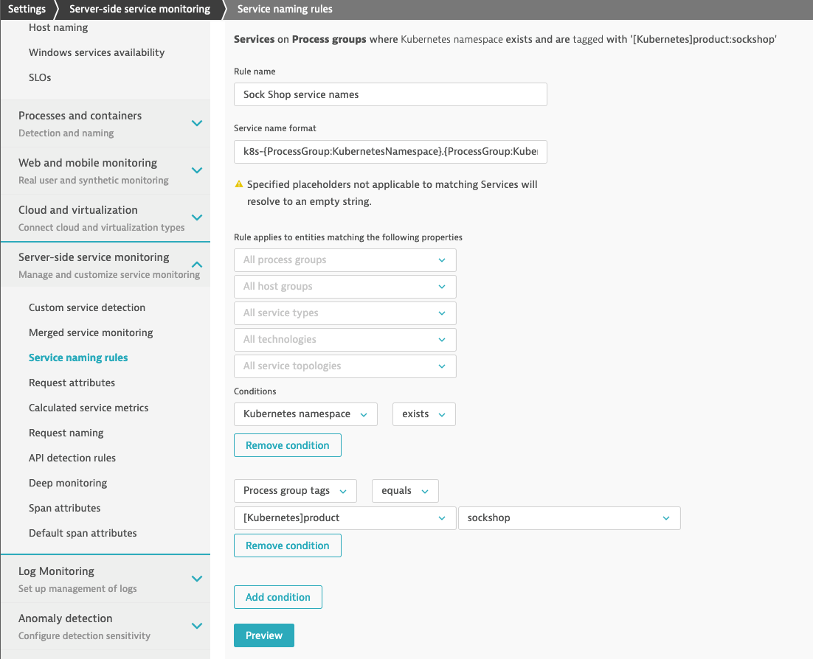
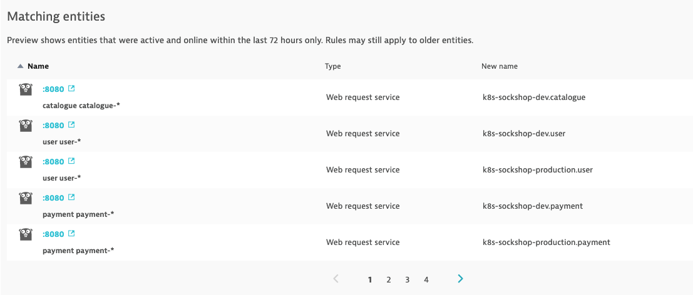
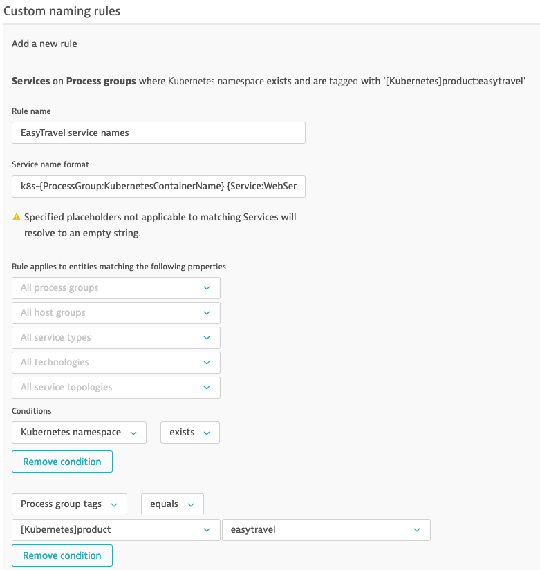
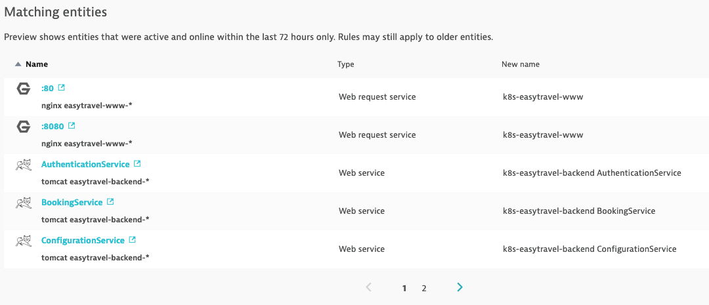
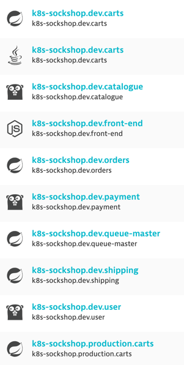
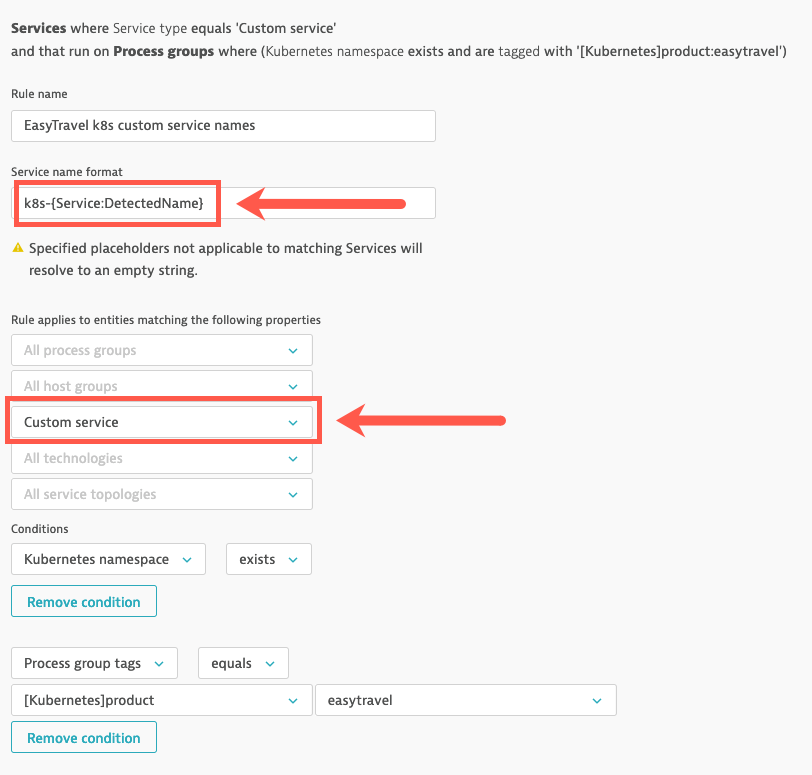

## Exercise #5 Customize Service naming rules for Kubernetes

### Explore auto-detected Service names

Take a quick look at the current <b>Service</b> naming as automatically assigned by Dynatrace with the built-in naming rules.

You can see <b>Services</b> in different locations in the Dynatrace console

- <b>Service & Transactions</b> view
- <b>Technologies/Process Groups</b> view : for a given <b>Process Group</b>, the infographic shows the <b>Service</b> implemented by the <b>Process Group</b>
- <b>Smartscape</b>

### Configure custom Service naming rules

We want to achieve with <b>Services</b> is having services showing up with names that tells us:

- Whether the <b>Services</b> are running in Kubernetes or not. Have Service name start with `k8s` for those in Kubernetes
- What project is the <b>Service</b> part of. Your company likely has multiple projects running in the same cluster.
- The <b>Service</b> namespace, which in our case with Sock Shop also tells us if it's production or dev
- The container name, which correspond to our microservice name
- In some cases, SpringBoot for example, there can be multiple web services for the same Java process. So we also want to see the Web Service name. 

Let's start with the Sock Shop application

Target Service naming convention :  `k8s-project-namespace-container Web Service Name`

Let's apply that configuration in Dynatrace!

- Go in <i>Settings -> Server-side service monitoring -> Service naming rules</i> and click <b>Add a new rule</b>
- Provide a name to the rule, for example : `Sock Shop service names`
- First, we want this rule to apply only to containerized processes running in Kubernetes. This is done by defining a condition.
  - In the conditions drop-down, select the property `"Kubernetes namespace"` and the condition `"exists"`
  - Click <b>Add condition</b>
  - Select the property `"Process group tags"` and the condition `"equals"`
    - Select the tag `[Kubernetes]product` and the tag value `sockshop`
- For the name format, we can enter free text and/or use placeholders.
  - Placeholders are in between brackets {} to distinguish them from free text
  - Enter this format : 
    - `k8s-{ProcessGroup:KubernetesNamespace}.{ProcessGroup:KubernetesContainerName} {ProcessGroup:Kubernetes:canary} {Service:WebServiceName}`

### Preview 

Before saving a rule that will affect the way information is displayed to all Dynatrace users, you would probably like to have a glance at the potential result. 

This is possible! :grinning:

- Click the <b>Preview</b> button
  - The left column shows the current auto-detected <b>Service</b> names as assigned by built-in rules
  - The right column shows the new names resulting from the application of the custom rule you defined

- Once done with Preview, click <b>Create rule</b>
- And <u><b>DON'T FORGET</b></u> to save (button at the bottom right)

### Custom service naming rule for EasyTravel

Because EasyTravel is not yet fully onboarded in Kubernetes, it does not yet follow the same policies as Sock Shop in terms of labeling, annotations and namespaces. We still want to make the EasyTravel services naming more intuitive but we will use a different rule than with Sock Shop.

Repeat the same procedure as with Sock Shop:

- Rule name : `EasyTravel service names`
- Service name format: `k8s-{ProcessGroup:KubernetesContainerName} {Service:WebServiceName}`
- Condition #1 : `"Kubernetes namespace"` does `"exists"`
- Condition #2 : `"Process group tags"` does `"equals"` tag name `[Kubernetes]product` with tag value `easytravel`

 - Preview:

- Click <b>Create rule</b> and <u><b>DON'T FORGET</b></u> to click the <b>Save</b> button!

### Built-in rules

You will notice there is a section named builtin rules. This is where the out-of-the-box service naming rules are defined. 

This is helpful to understand how Dynatrace come out with auto-discovered service names. 

### Validate

Navigate to the <b>Transactions & Services</b> view to look at the applied custom service naming rules.

It might take a few seconds for all services to show up with the new names. If the naming doesn't change, it's probably that you forgot to save the rule... You will have to repeat the previous steps to create it again. :unamused:

Hey, wait a minute! What about the simulated `findJourneysService` that we created for EasyTravel. We can't find it anymore!
Remember, the naming rule uses the container name; `findJourneysService` is not yet a microservice, it doesn't run in its own container but still run in the `easytravel-backend` container.

What you can do *** optional **** is to create a specific service naming rule for that case.

- Rule name : `EasyTravel k8s custom service names`
- Service name format: `k8s-{Service:DetectedName}`
- Rule applies to entities matching the following properties : Service type = "Custom Service"
- Condition #1 : `"Kubernetes namespace"` does `"exists"`
- Condition #2 : `"Process group tags"` does `"equals"` tag name `[Kubernetes]product` with tag value `easytravel`
- Click Preview
- <u>DO NOT FORGET TO SAVE!!!</u>

Now, because you created that latest rule after the others, it will show up at the bottom of the list.

- Service Naming Rules are applied in descending order, meaning a rule above another has precedence.
- Because the rule you created for the Custom Service (findJourneyService) is more specific, you want it applied before the other more generic EasyTravel naming rule. 
- Use the arrow to move up and down the rules.

You can validate everything is in order in the <b>Transactions and Services</b> view.

---

[Previous : #4 Customize Process Group naming rules for k8s](../04_Customize_PG_naming_rules) :arrow_backward: :arrow_forward: [Next : #6 Create Management Zones by application](../06_Management_Zones_by_application)

:arrow_up_small: [Back to overview](../)