## Exercise #8 Canary Deployment

### A Comedy of Errors

#### Scenario

So you averted a embarassing situation with the help of Dynatrace when you tested the new `carts` service release... and quickly found the issue.

But now, it's the turn of the marketing department to strong-arm you. :mechanical_arm:


The marketing team has been working on a promo campaign, again involving new shopping carts features and incidently a new `carts` service release.

Since promo campaign is already late on its schedule the `carts` service has been duct-taped and the project fast-tracked to be deployed in production. This time your requests for more testing time in dev are rejected!


Fortunately, you have a strategy.

### Service Mesh at the rescue

The Kubernetes platform team has recently deployed <b>Istio</b>, <i>a service mesh</i>, on your Kubernetes cluster. Istio provides dynamic traffic management capabilities, without any code change. 

You managed to convince the Sock Shop management team to not expose the new <b>carts-v2</b> service to every visitor. The promo campaign is targeting primarily non-customers. And the customer service department is a bit wary, they don't want to expose loyal customers to risky changes.

So it is decided that, until proven to be solid, the new `carts-v2` service will only be available to non-customers (users who are not logged in). Existing customers (users logged-in) will stay on the current version of <b>carts</b>. The frontend was also cosmetically changed, depending the version of `carts` that traffic will be sent to, the header color will vary : `v1` is in grey, `v2` is in blue.

Essentially, you are implementing a canary release. You are only partially exposing the new service release to a subset of the overall traffic, under specific conditions. If the release proves to work as intended, it will be eventually promoted and it will get all the traffic. Otherwise, you have quick mechanism to redirect all traffic to the current stable release while you fix the faulty one.  

### Let's deploy that v2!

Go in the web terminal, make sure your are in the `exercises` directory. Execute the following:

```sh
$ ./deploy-carts-frontend-v2.sh
```

The next command will configure Istio <i>virtual routes</i> that are implementing the traffic management rules via the <b>Envoy</b> proxy sidecar containers running in each pod of the `sockshop-production` namespace.

```sh
$ ./configure-v1-v2-traffic-management.sh
```
We want to keep an eye on a specific web service method of the `carts` service, which is `addToCart`. 

In the Dynatrace console:

- Go to the <b>Transactions and Services</b> view
- Find the `k8s-sockshop-dev.carts ItemsController` service and drill-down to it
- Click on the <b>View requests</b> button

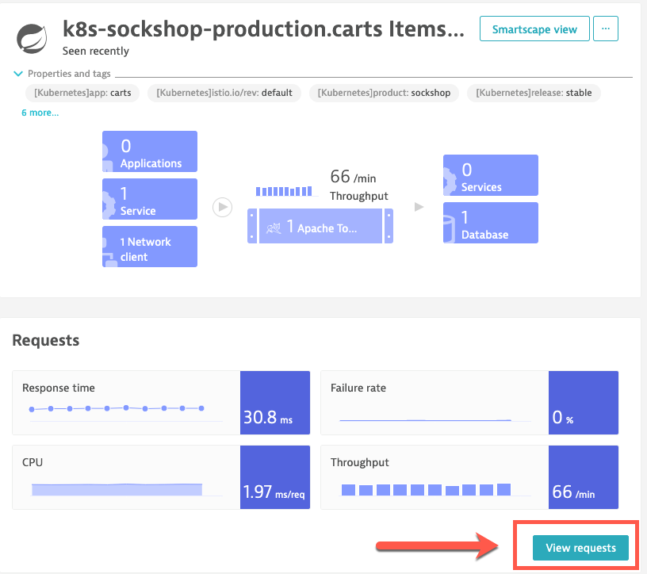

- In the details view, scroll down to the bottom, in the top contributors you will see `addToCart`. Click on it.
- In the next view, on the top right of the screen, you will see a button with an ellipsis (...), click on it
- Click on <b>Pin to dashboard</b>

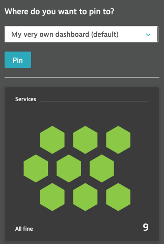

- Select your very own perform HOT dashboard.
- Place the tile somewhere on the dashboard and click <b>Done</b> for the tile and <b>Done</b> once again (for the dashboard).

We will repeat the same steps for the new release of the service : `k8s-sockshop-production.carts v2 ItemsController`.

In the dashboard, you can place the tiles next to `carts-db write latencies` tile and under the `SockShop Prod services` tile and add a nice header tile above it. Something like this:

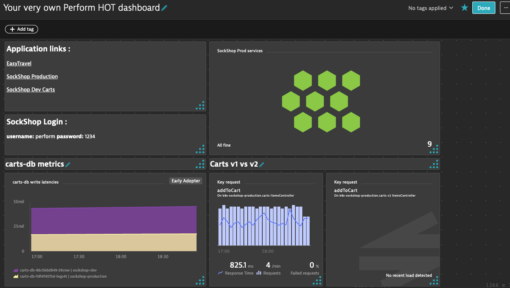

Don't forget to click the <b>Done</b> button!

Then return to the web terminal where you will turn on the promo campaign via feature flag implemented in the `carts-v2` code.

```sh
$ ./toggle-sockshop-promo-ff.sh
```
At the prompt, enter <b>1</b>.

### How are we doing with this promo feature?

So, after the break, problems should show up in the Problems feed. Switch to the new feed.


- Filter for the `sockshop devops` alerting profile <b>(1)</b>; this confirms the devops team received the problem notification
- There might one or multiple problems displayed, depending on the problems distinct evolution. Eventually (after a few minutes), the DAVIS AI will figure out those distinct problems are related and they will be grouped into, hopefully, a single one, with a root cause analysis provided. <b>(2)</b>
- Drill down to that problem ticket

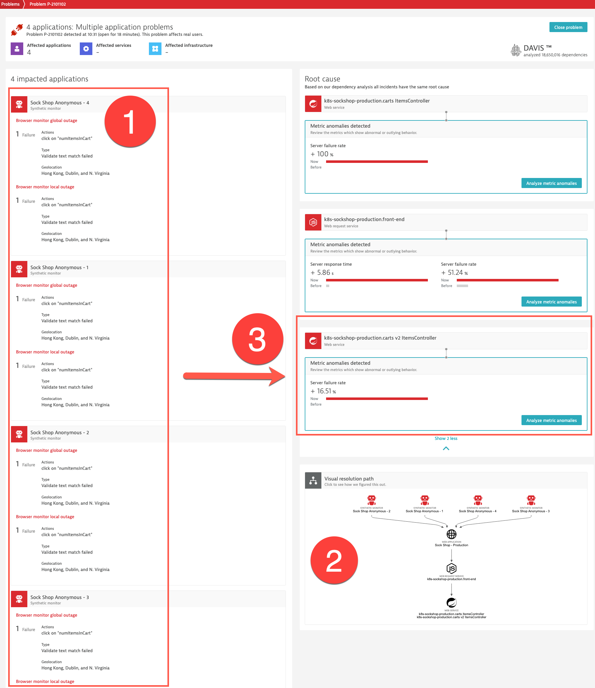

Wow, plenty of interesting information here!

- We first see <b>(1)</b> that the problem was detected by our early warning system, the <b>Synthetic Monitors</b>! An expected text match validation failed on a step that is clicking on the shopping cart button. And only the monitors simulating anonymous (no login) visits failed. Hmm, interesting, shopping cart again? Are you kidding me? :thinking: 
- DAVIS also provides us, with the <b>Visual Resolution Path</b>, an overview <b>(2)</b> of the entities in your topology that are affected by the problem under analysis with the ability to review the associated events in a timeline.
- And the last part, but certainly not the least, of the problem ticket is the automatic root cause analysis. DAVIS shows the entities, events and metrics that are in the causal fault-tree analysis. Here <b>(3)</b>, we see `k8s-sockshop-production.carts v2 ItemsController` is identified as the cause of the issue.
- Drill-down into that service

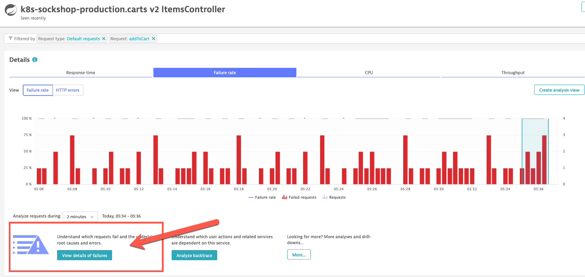

- Click on <b>View details of failures</b>

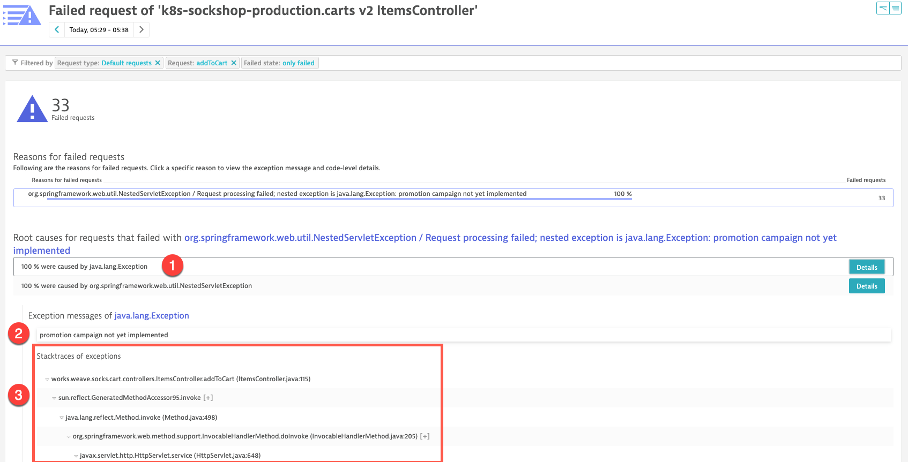

- Dynatrace leads to the exact cause of the failures. 100% of the failures <b>(1)</b> are caused by a Java exception thrown in the `addToCart` request execution.
- The exception message providing you the context <b>(2)</b>. Here we see that part of the code is a "stub". The promotion campaign code was not even totally completed and it was released to production!!! :angry: :rage: ::cursing_face:
- But you have the information needed to fix that part of the code. Dynatrace even provides you the exception stack trace <b>(3)</b>, which is an important piece of information for your developers.

Also, remember you added a specific visualization in "your very own dashboard" to keep an eye on carts v1 vs v2? The devops team was looking at it during the launch and they've seen what was going on at the same time they were receiving the alert.

- <b>Menu -> Dashboards</b>

&nbsp;

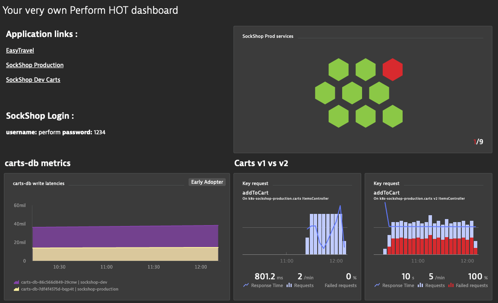

&nbsp;

We can see one of the services from SockShop Prod is in problem (if you want, you can click on the tile to drill-down). We also see a side-by-side comparison of carts v1 vs v2 and it is kind of obvious v2 is not doing well... :unamused:

If you want to see how the customer is affected by the issue, of course you can try yourself on the SockShop web site.

- Load the page in your browser (if you already have it loaded, refresh it or click the logo to load the home page).
  - Reminder, you can find the link from "your very own dashboard" in the Dynatrace console
- Try first with a logged in user (username: perform , password: 1234)
- Click on a pair of socks of your choice
- Click on the <b>Add to cart</b> button
- Within a second, the cart status (button top right) should be updated with a number of `1 item(s) in the cart`
- Now logout (top right)
- Repeat the same steps without a log in
  - When you hit the <b>Add to cart</b> button, nothing will happen. The cart status button will keep showing `0 items in the cart`, whatever the amount of times your are trying to add the item in the cart.
  - If you would be looking at the api calls (with a browser developer tools or Fiddler), you would see a call to `/carts` that is returning a `HTTP 500` error code.

Similar information (and more details) are also available from the synthetic test analysis.

- In the Dynatrace console, go back to the problem ticket details.
- Click on one of the failing <b>Synthetic Monitor</b>
- In the monitor details view, get to the <b>Errors</b> section
- Click the <b>Analyze errors</b> button

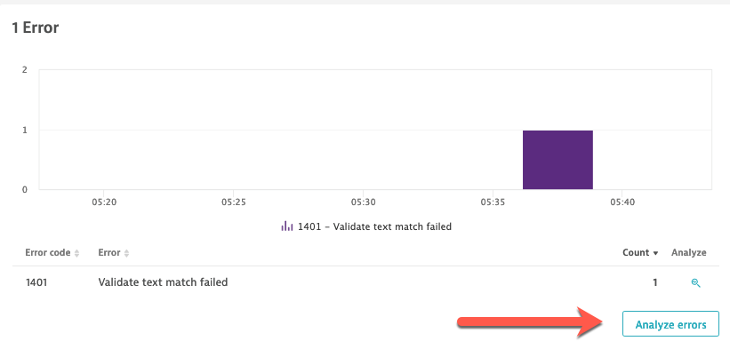

- The <b>Detailed analysis</b> view will show you the test executions by timestamp. <b>(1)</b>
- Select one of those
- The executed test step (with screen captures) are displayed to the right.
- The failing one is in red. Select it. <b>(2)</b>
- You will then get the option to analyze the differences in screen captures/ <b>(3)</b>


- Click on the <b>Show differences</b> button
- You then have access to a rotation of 3 screen displays
  - Expected display (taken from passing test executions)
  - Actual display (taken from this specific failing test execution)
  - Difference (juxtaposition of expected and actual)
  - We can clearly see the actual does not have any item in the shoppping cart even though the expected test execution successfully add the item in the cart.

&nbsp;  
<b>Expected</b>
&nbsp;

&nbsp;
<b>Actual</b>
&nbsp;
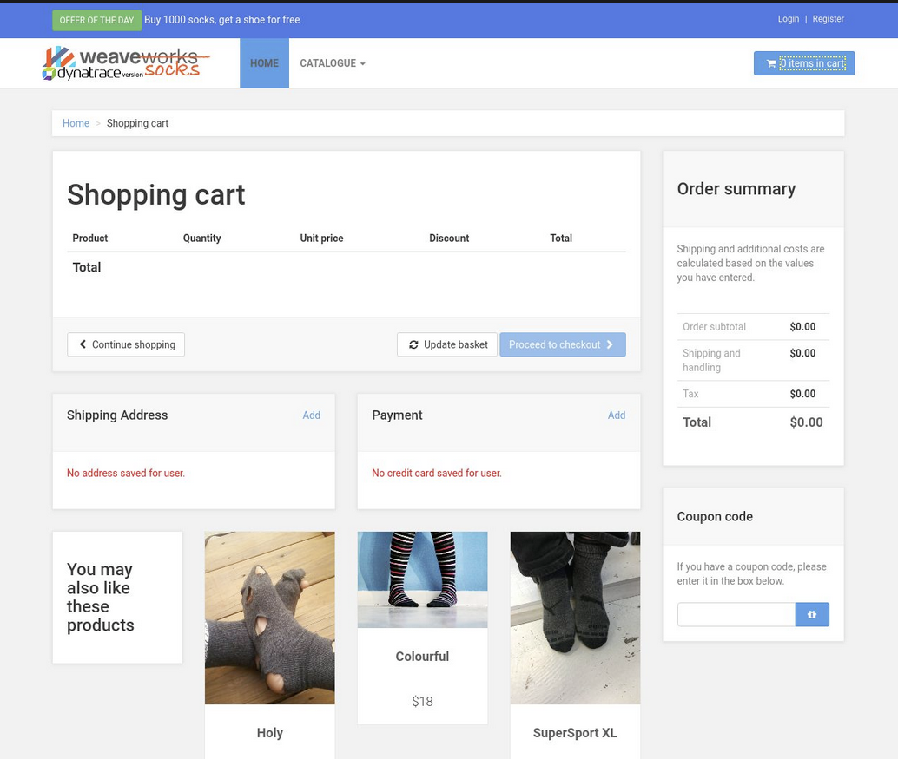
&nbsp;
<b>Difference</b>
&nbsp;
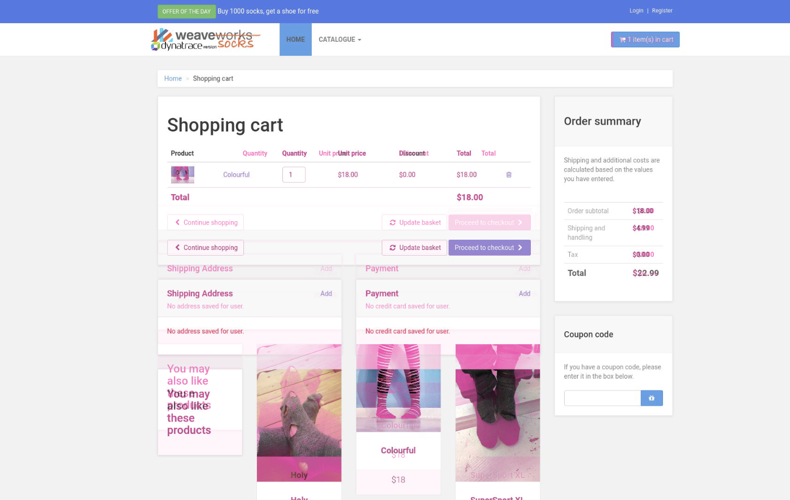
&nbsp;
You can also take a look at the web application monitoring view

- <b>Menu -> Applications -> SockShop - Production</b>
- We can see <b>(1)</b>, that for this web application, problems have been detected that are originating from the server-side.


- Click on <b>View service flow</b> <b>(2)</b> to take a look at the end-to-end ditributed tracing accross the microservices serving the web app
    - Dynatrace displays the service flow from the `front-end` service down to the backend
    - We see the calls to the stable `carts` service and those to promo `carts-v2` service.
    - From this view, there are many options of filtering and drill-down analysis
  


- Let's go back to the web application view
- In <b>(3)</b>, we see that for the Sock Shop web app, Dynatrace detected a <b>25,000%</b> increase in the number of HTTP 500 errors! :exploding_head: 
 - Click on <b>HTTP 500: /cart</b>
 - Here we are getting a different perspective on the promo issue. 
   - What was the impact on the front-end
   - Who are the users impacted? Where do they come from?
   - Drill downs to <b>User Actions</b> and <b>User Sessions</b> for more business-related contextual data.

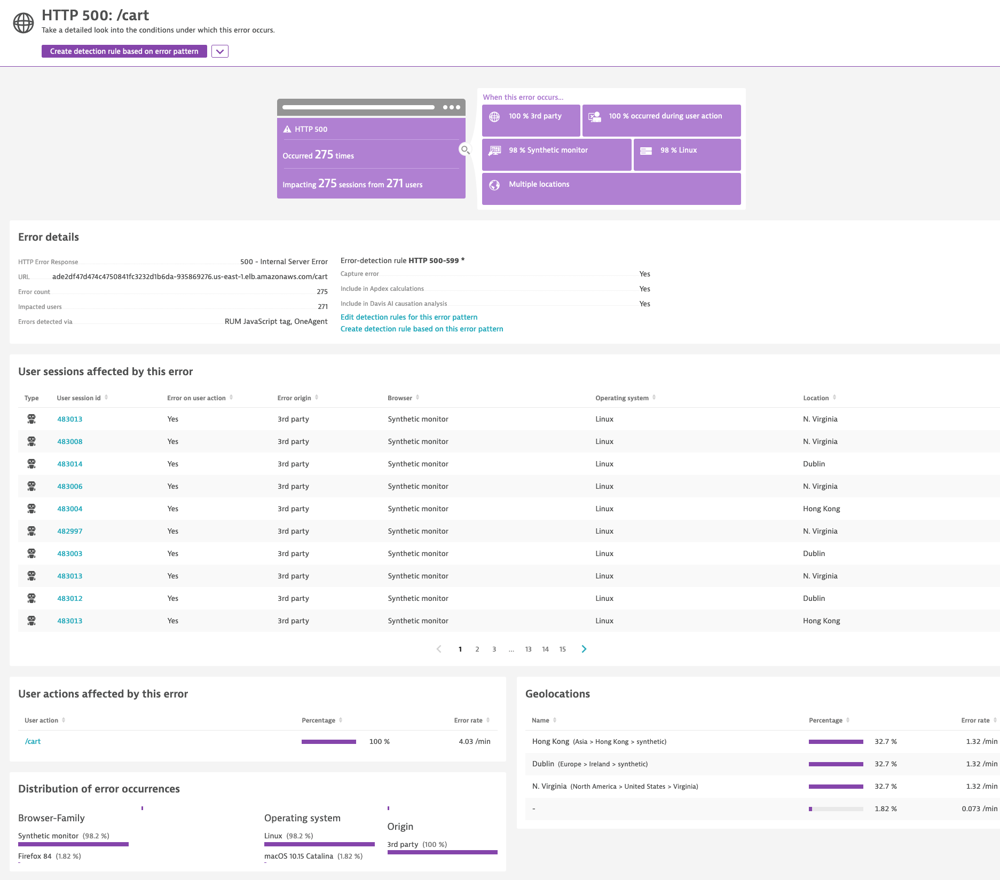

The Customer Service department is not too happy about the situation. I'm thinking they might be very interested by that kind of information...

### <b><ins>OPTIONAL</ins></b> - Getting visibility on the Envoy proxies

Istio is leveraging <i>Envoy</i> as a proxy server for ingress/egress control and in-cluster dynamic traffic management. <b>Envoys</b> are injected as sidecar containers running in the same pod as your microservice. This is why for, Istio-injected namespaces and pod, such as our `sockshop-production`, we can see 2 containers per pod (3 in the specific case of `carts-db` because there is also the MongoDB Prometheus exporter which runs as another sidecar).

Istio is more part of the Kubernetes plumbing and is normally more the concern of the platform administrators. But, because they are used as inbound and outbound proxies for each of your microservice, it might be important for you to get insights on the <b>Envoys</b>, making sure they are not impacting negatively the performance of your entire microservice ecosystem.

Once again, Dynatrace is your friend here. :handshake:

In the Dynatrace console:

- <b>Menu -> Settings -> Monitoring -> Monitored technologies</b>
- Make sure the <b>Supported technologies</b> tab is selected
- Scroll down to <b>Envoy</b> and click the edit icon


- Enable <b>Envoy</b> monitoring


Now, as with any other technology, getting service-level insight requires instrumentation and this is done at process/container startup. It's no different with <b>Envoy</b>. Because the <b>Envoys</b> are side-car containers of your microservice pods, you will need to bounce the Sock Shop pods to have the Envoy containers restarted.

In the web terminal, execute: 

```sh
$ ./recycle-sockshop-app-pods.sh 
```

With that, you have added Envoy technology as new <b>Services</b> in Dynatrace.

In the Dynatrace console :

- Go in <b>Transactions and Services</b>
- Find the `default web request / envoy istio-ingress-gateway` service and click on it


- Then click on the <b>Service Flow</b>


What we see here are additional services, which are the <b>Envoy</b> proxies. We see the same Envoy side car as inbound and outbound of the main microservice container. This can help to find out if there's any issue that is specific to the Envoy proxies and not the application specific containers.

You might think ensuring the health of Istio/Envoy technologies is more a platform ops concern as those are components of Kubernetes plumbing... and you might be right. But, in the Kubernetes world, apps and platform techs are intertwined and, in a typical devops fashion, it might be beneficial to have insight on the impact that techs as Istio/Envoy can have on your applications.

&nbsp;

### Removing the promo feature from the live site

Luckily, more robots :robot: than real users were affected by this fiasco. Put let's not push our luck... Because we have a service mesh, we can dynamically redirect the traffic to the stable release and everything will back to normal (except no more promo).

Disable the promo feature by running, in the web terminal, the following command and enter `2` at the prompt :

```sh
$ ./toggle-sockshop-promo-ff.sh
```

We'll also instruct <b>Istio</b> to redirect the traffic to the stable `carts` release (v1).

```sh
$ ./revert-to-v1-traffic-management.sh
```

This will put an end to the transaction failure and after some time (between 5 and 10 minutes), the live problems will be closed automatically.

---

[Previous : #7 : Detect Problems](../07_Detect_Problems/README.md) :arrow_backward: :arrow_forward: [Next : #9 : Manage your Workload Resource Usage](../09_Manage_Workload_Resource_Usage/README.md

:arrow_up_small: [Back to overview](../README.md)